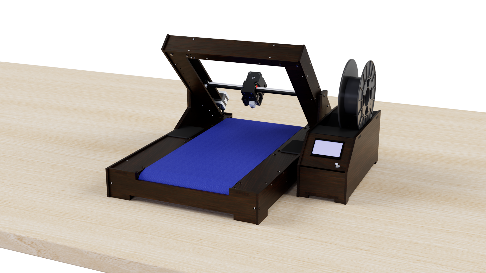
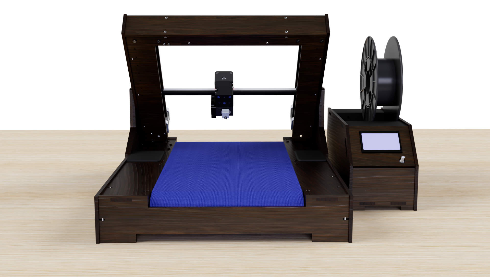

# 3dLoop
## Intro

3D printers are awesome machines, but they come with a variety of limitations:

First: the printed object is mostly small. Prints are always smaller than the printer itself. So if you want to make big prints, you need a big printer and even with this big printer are the possibilities limited.

Second: When the printer is finished printing your object, human interaction is needed to proceed the next print. The printer isn’t able to remove the printed object and start a new one.

To produce parts fast and cost-effectively, I’ve designed a printer that can print many parts sequentially. Not only will it be more costeffective than other printers, it will be fairly easy to reproduce the printer with a minimal need of tools. I tried to make as many parts as possible with tools that are accessible in a FabLab.

The printer uses a conveyor belt as print bed, whereas a normal printer uses a fixed build plate. A belt as printbed enables the printer to roll off the object and start printing a new one and it make it possible to make objects that are (almost) Infinite in 1 direction.

## Configuration 1 (Infinite printing)

## Configuration 2 (Normal 3D printer with automated object rejection)

This printer is fully custom made, every part is carefully designed to make sure the machine will work as good as possible.

On this Github page, you can find all the details about this printer. I share all the designfiles as well as software, firmware and used parts.

Don't hesitate to contact me or post a comment if you have any questions!

