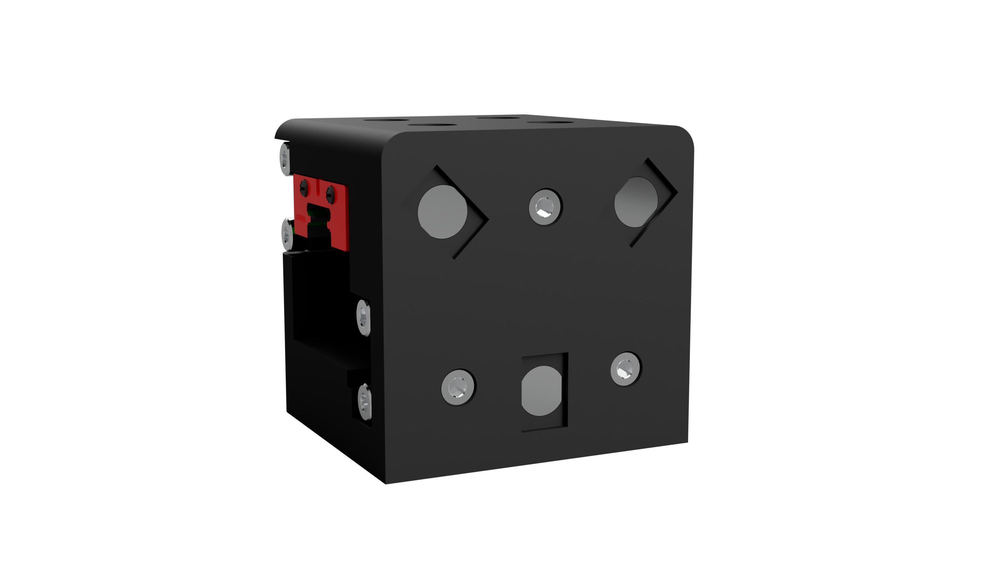
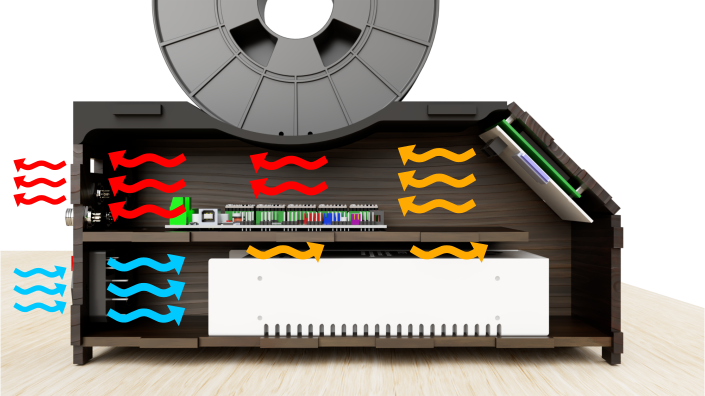

# 3dLoop
## Intro

3D printers are awesome machines, but they come with a variety of limitations:

First: printed objects are mostly small. Prints are always smaller than the printer itself. So if you want to make big prints, you need a big printer and even with this big printer are possibilities limited.

Second: When the printer is finished printing your object, human interaction is needed to proceed the next print. The printer isn’t able to remove the printed object and start a new one.

To produce parts fast and cost-effectively, I’ve designed a printer that can print many parts sequentially. Not only will it be more costeffective than other printers, it will be fairly easy to reproduce the printer with a minimal need of tools. I tried to make as many parts as possible with tools that are accessible in a FabLab/makerspace.

The printer uses a conveyor belt as print bed, whereas a normal printer uses a fixed build plate. A belt as printbed enables the printer to roll off the object and start printing a new object. This also makes it possible to make objects that are (almost) infinite in 1 direction.

There are 2 differtent configurations in which the printer can be configured.
I will describe the 2 differtent configurations separatly:

## Configuration 1 (Infinite printing)

In this configuration, It's possible to make objects with one infinite dimention.
The X,Y-assembly is oriented under an 45 degree angle towards the bed assembly.
This is especially usefull for extrusions, but it makes it also possible to print objects without support wereas normal printers would need support. For every layer, the bed system rols a bit further. In that way, objects can be bigger than the length of the belt.

## Configuration 2 (Normal 3D printer with automated object ejection)

This configuration give you all the advantages of the standard XYZ setup with the addition of automaticly rejection of the print. It makes it possible to print many objects, without the need of human interaction between diffrent objects. This is especially handy when you want to make a printfarm, or want to print many parts when you're away or sleeping.

The design makes it very easy to switch between the two configurations. The extruderassembly is magnetic detatchable. It's possible to attach the extruderassembly in 2 different orientations to the X-carriage.

The XY-axis assembly is easy detatchable from the Z-axis assembly by unscrewing 3 screws on each side.

By the use of two side pannels, the XY-as can be easely swichted between the two configurations. In the side pannels there are holes to mount the XY-axis vertically (Configuration 2) and under a 45 degree angle (Configuration 1).

## Electronic Box
The mainbord and powersupply are mounted inside a seperate unit, the electronic box.
The printer uses a MKS GEN 1.4 board, to run the Marlin firmware.
In the electronic box, there was special attention needed to the airflow, to prevent the closed box form overheating.
On the top of this box, there is a spoolholder.

On the back of the box, there are all the connectors for the differtent components. The use of connectors makes transportation of the printer easier.

##
This printer is fully custom made, every part is carefully designed to make sure the machine will work as good as possible.

On this Github page, you can find all the details about this printer. I share all the designfiles as well as software, firmware and used parts.

Don't hesitate to contact me or post a comment if you have any questions!

